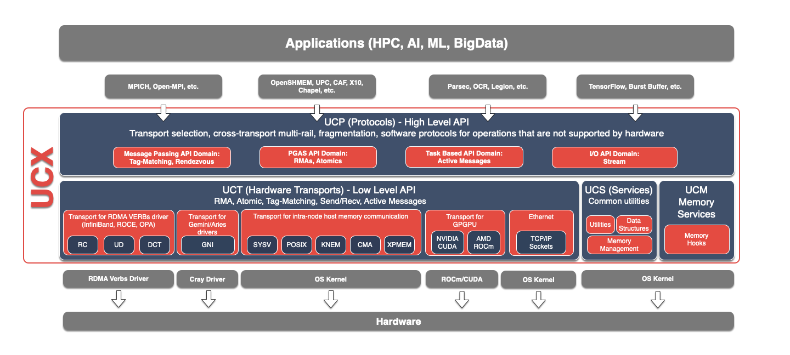

UCX-Py
======

.. warning::

    UCX-Py has been discontinued, version 0.45 (RAPIDS 25.08) was its last release and it will receive no further updates, see the `RAPIDS Support Notice 50 <https://docs.rapids.ai/notices/rsn0050/>`_ for details. Projects depending on UCX-Py are advised to migrate to `UCXX <https://github.com/rapidsai/ucxx>`_ immediately. `UCXX documentation <https://docs.rapids.ai/api/ucxx/nightly/>`_.

UCX-Py is the Python interface for `UCX <https://github.com/openucx/ucx>`_, a low-level high-performance networking library.  UCX and UCX-Py supports several transport methods including InfiniBand and NVLink while still using traditional networking protocols like TCP.

.. toctree::
   :maxdepth: 1
   :hidden:

   quickstart
   install
   configuration
   deployment
   ucx-debug

.. toctree::
   :maxdepth: 1
   :hidden:
   :caption: Help & reference

   os-limits
   transport-monitoring
   send-recv
   api
   glossary
